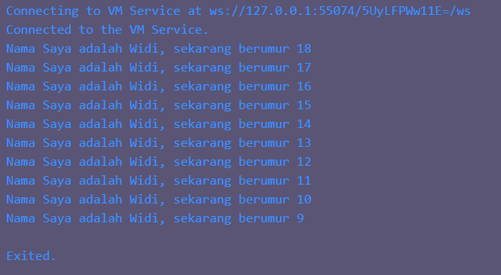

# Soal 1
### Modifikasilah kode pada baris 3 di VS Code atau Editor Code favorit Anda berikut ini agar mendapatkan keluaran (output) sesuai yang diminta!
```dart
void main(){
  for (int i = 0; i < 10>; i++) {
    print('hello ${i + 2}');
  }
}
```
Output yang diminta (Gantilah Fulan dengan nama Anda):
```
Nama Saya adalah Fulan Sekarang berumur 18
Nama Saya adalah Fulan Sekarang berumur 17
Nama Saya adalah Fulan Sekarang berumur 16
Nama Saya adalah Fulan Sekarang berumur 15
Nama Saya adalah Fulan Sekarang berumur 14
Nama Saya adalah Fulan Sekarang berumur 13
Nama Saya adalah Fulan Sekarang berumur 12
Nama Saya adalah Fulan Sekarang berumur 11
Nama Saya adalah Fulan Sekarang berumur 10
Nama Saya adalah Fulan Sekarang berumur 9
```
#### Jawaban [code](./src/soal1.dart):
```dart
void main() {
  for (int i = 18; i > 8; i--) {
    print('Nama Saya adalah Widi, sekarang berumur ${i}');
  }
}
```
Skrinshut:\


# Soal 2
### Mengapa sangat penting untuk memahami bahasa pemrograman Dart sebelum kita menggunakan framework Flutter ? Jelaskan!
#### Jawaban:
Dart sangat penting untuk dipahami sebelum menggunakan framework Flutter karena framework Flutter dibangun di atas bahasa pemrograman Dart. Dengan Dart, kita dapat membuat aplikasi yang lebih efektif dan efisien.

# Soal 3
### Rangkumlah materi dari codelab ini menjadi poin-poin penting yang dapat Anda gunakan untuk membantu proses pengembangan aplikasi mobile menggunakan framework Flutter.
#### Rangkuman:
- Dart menjadi prasyarat utama untuk dapat mengembangkan aplikasi menggunakan Flutter secara efektif
- Sintax dart mirip bahasa C, Java, Javascript
- Desain arsitektur Flutter sangat dipengaruhi oleh kapabilitas dan fitur yang dimiliki oleh Dart
- Pemrograman Berorientasi Objek (OOP)
- Eksekusi kode Dart dapat beroperasi dalam dua mode: kompilasi Just-In-Time (JIT) atau Kompilasi Ahead-Of-Time (AOT)

# Soal 4
Buatlah penjelasan dan contoh eksekusi kode tentang perbedaan Null Safety dan Late variabel !
#### Jawaban:
Null Safety adalah fitur yang memungkinkan compiler untuk memastikan bahwa variabel tidak dapat bernilai null. Dengan fitur ini, compiler akan memperingatkan jika kita akan memberikan nilai null pada variabel yang tidak dapat null.

Late variabel adalah fitur yang memungkinkan kita untuk membuat variabel yang belum diinisialisasi. Dengan ini, kita dapat menginisialisasi variabel setelah deklarasi.

Contoh penggunaan Null Safety dan Late variabel:\
[Code](./src/soal4.dart):
```dart
void lateExample() {
  late String nama;
  // print(nama); Error: Late variable 'nama' without initializer is definitely unassigned.
  nama = 'Widi';
  print(nama); // Output: Widi
}

void nullAbleExample() {
  String? nama; // Nilai awal null
  nama = null; // Bisa diberi nilai null
  print(nama); // Output: null
  print(nama ?? 'Nama belum diisi'); // Output: Nama belum diisi
  // Contoh penggunaan null-aware operator, tanpa hal tersebut maka akan Error: Property 'length' cannot be accessed on 'String?' because it is potentially null.
  print(nama?.length ?? 0); // Output: 0
  nama = 'Widi';
  print(nama); // Output: Widi
}

void main() {
  lateExample();
  nullAbleExample();
}
```

