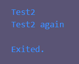

# Tugas Praktikum
## 1. Silakan selesaikan Praktikum 1 sampai 3, lalu dokumentasikan berupa screenshot hasil pekerjaan beserta penjelasannya!
### Praktikum 1:  Menerapkan Control Flows ("if/else")
#### Langkah 1
Ketik atau salin kode program berikut ke dalam fungsi main().
``` dart
String test = "test2";
if (test == "test1") {
   print("Test1");
} else If (test == "test2") {
   print("Test2");
} Else {
   print("Something else");
}

if (test == "test2") print("Test2 again");
```

#### Langkah 2
Silakan coba eksekusi (Run) kode pada langkah 1 tersebut. Apa yang terjadi? Jelaskan!

Karena `test` bernilai `"test2"`, maka kondisi `else if (test == "test2")` terpenuhi dan mengeksekusi kode di dalamnya, yaitu `print("Test2");`. Kemudian, ada kondisi `if (test == "test2")` terpenuhi, maka mengeksekusi kode di dalamnya, yaitu `print("Test2 again");`.\
Output:\


#### Langkah 3
Tambahkan kode program berikut, lalu coba eksekusi (Run) kode Anda.
``` dart
String test = "true";
if (test) {
   print("Kebenaran");
}
```
#### Apa yang terjadi ? Jika terjadi error, silakan perbaiki namun tetap menggunakan if/else.
Terjadi error karena `test` bernilai string `"true"` dan tidak dapat dievaluasi sebagai boolean. Diperbaiki dengan menggati tipe data dengan `bool`
sehingga:
``` dart
bool test1 = true;
if (test1) {
  print("Kebenaran");
}
```
Output:\


### Praktikum 2: Menerapkan Perulangan "while" dan "do-while"
#### Langkah 1:
Ketik atau salin kode program berikut ke dalam fungsi main().
``` dart
int counter = 0;
while (counter < 33) {
  print(counter);
  counter++;
}
```

#### Langkah 2
Silakan coba eksekusi (Run) kode pada langkah 1 tersebut. Apa yang terjadi? Jelaskan! Lalu perbaiki jika terjadi error.

Terjadi perulangan sebanyak 33 kali karena nilai awal `counter` adalah 0.\
Terjadi error karena tidak ada variable `counter` \
Output:\


#### Langkah 3
Tambahkan kode program berikut, lalu coba eksekusi (Run) kode Anda.
``` dart
counter = 0;
do {
  // print(counter);
  stdout.write("$counter ");
  counter++;
} while (counter < 77);
```
#### Apa yang terjadi ? Jika terjadi error, silakan perbaiki namun tetap menggunakan do-while.

terjadi pengulangan do-while, dimana melakukan sesuatu terlebih dahulu dan melakukan pengecekan setelahnya\
Output (diprint secara horizontal menggunakan `stdout.write("$counter ");`):\


### Praktikum 3: Menerapkan Perulangan "for" dan "break-continue"
#### Langkah 1
Ketik atau salin kode program berikut ke dalam fungsi main().
``` dart
for (int index = 10; index < 27; index++) {
  print(index);
}
```
### Langkah 2
Silakan coba eksekusi (Run) kode pada langkah 1 tersebut. Apa yang terjadi? Jelaskan! Lalu perbaiki jika terjadi error.

Terjadi perulangan for-loop sebanyak 17 kali, pada setiap iterasi, nilai `index` akan di print.\
Terjadi error karena penulisan variable `index` tidak benar.
Output:\


### Langkah 3
Tambahkan kode program berikut di dalam for-loop, lalu coba eksekusi (Run) kode Anda.
``` dart
if (index == 21)
  break;
else if (index > 1 || index < 7)
  continue;
print(index);
```
#### Apa yang terjadi ? Jika terjadi error, silakan perbaiki namun tetap menggunakan for dan break-continue.
Terjadi perulangan for-loop sebanyak 17 kali, namun karena adanya `break` ketika `index` sama dengan 21, maka perulangan akan berhenti. Selain itu, terdapat juga `continue` ketika `index` lebih dari 1 atau kurang dari 7, maka perulangan akan melanjutkan ke iterasi berikutnya tanpa mengeksekusi kode di bawahnya. Output yang dihasilkan tidak ada.\
Terjadi error karena penulisan `index` dan logika `if`, `else if` tidak benar

## 2. Buatlah sebuah program yang dapat menampilkan bilangan prima dari angka 0 sampai 201 menggunakan Dart. Ketika bilangan prima ditemukan, maka tampilkan nama lengkap dan NIM Anda.
[Code](./src/soal2.dart):
``` dart
void main() {
  for (int i = 0, count = 0; i <= 201; i++) {
    if (isPrime(i)) {
      count++;
      print(
        'Bilangan prima ke-$count adalah $i, Hidayat Widi Saputra, NIM 2341720157',
      );
    }
  }
}

bool isPrime(int n) {
  if (n < 2) return false;
  if (n % 2 == 0) return n == 2;
  for (int i = 3; i * i <= n; i += 2) {
    if (n % i == 0) return false;
  }
  return true;
}
```
Output:\


## 3. Kumpulkan berupa link commit repo GitHub pada tautan yang telah disediakan di grup Telegram!
