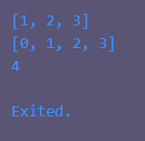

# Tugas Praktikum

## 1.Silakan selesaikan Praktikum 1 sampai 5, lalu dokumentasikan berupa screenshot hasil pekerjaan Anda beserta penjelasannya!

### Praktikum 1: Eksperimen Tipe Data List

#### Langkah 1

Ketik atau salin kode program berikut ke dalam void main().

```dart
var list = [1, 2, 3];
assert(list.length == 3);
assert(list[1] == 2);
print(list.length);
print(list[1]);

list[1] = 1;
assert(list[1] == 1);
print(list[1]);
```

#### Langkah 2

Silakan coba eksekusi (Run) kode pada langkah 1 tersebut. Apa yang terjadi? Jelaskan!

Penjelasan:\
Akan menampilkan hasil yang benar ketika di eksekusi, karena kode tersebut memanggil fungsi assert() yang akan mengecek apakah kondisi yang di berikan benar atau tidak. Jika kondisi yang di berikan salah maka fungsi assert() akan mengembalikan error dan program akan berhenti.\
Output:\


#### Langkah 3

Ubah kode pada langkah 1 menjadi variabel final yang mempunyai index = 5 dengan default value = null. Isilah nama dan NIM Anda pada elemen index ke-1 dan ke-2. Lalu print dan capture hasilnya.\
Apa yang terjadi ? Jika terjadi error, silakan perbaiki.

Code:

```dart
final List list = List<String?>.filled(5, null);
list[1] = 'Hidayat Widi Saputra';
list[2] = '2341720157';

print('Length list: ${list.length}');
print('Element index 1: ${list[1]}');
print('Element index 2: ${list[2]}');
print('List: $list');
```

Penjelasan:

- Menggunakan final sehingga referensi list tidak bisa diubah.
- `List<String?>` membuat value list berisi String yang nullable.
- List.filled(5, null) membuat list dengan 5 elemen, dengan nilai awal null semua

Output:\


### Praktikum 2: Eksperimen Tipe Data Set

#### Langkah 1

Ketik atau salin kode program berikut ke dalam fungsi main().

```dart
var halogens = {'fluorine', 'chlorine', 'bromine', 'iodine', 'astatine'};
print(halogens);
```

#### Langkah 2

Silakan coba eksekusi (Run) kode pada langkah 1 tersebut. Apa yang terjadi? Jelaskan! Lalu perbaiki jika terjadi error.

Penjelasan:

- Variable `halogens` dideklarasikan sebagai Set
- Menampilkan value dari `halogens`

Output:\


#### Langkah 3

Tambahkan kode program berikut, lalu coba eksekusi (Run) kode Anda.

```dart
var names1 = <String>{};
Set<String> names2 = {}; // This works, too.
var names3 = {}; // Creates a map, not a set.

print(names1);
print(names2);
print(names3);
```

Apa yang terjadi ? Jika terjadi error, silakan perbaiki namun tetap menggunakan ketiga variabel tersebut. Tambahkan elemen nama dan NIM Anda pada kedua variabel Set tersebut dengan dua fungsi berbeda yaitu .add() dan .addAll(). Untuk variabel Map dihapus, nanti kita coba di praktikum selanjutnya.

Penjelasan:
Mendeklarasi tiga variabel:

- `var names1 = <String>{};`: Set kosong bertipe String secara eksplisit
- `Set<String> names2 = {};`: Set kosong bertipe String dengan deklarasi tipe
- `var names3 = {};`: adalah sebuah Map kosong, bukan sebuah Set

Output:\


Kode setelah ditambahkan:

```dart
var names1 = <String>{};
Set<String> names2 = {};
var names3 = <String>{};

// .add()
names2.add('Hidayat Widi Saputra');
names2.add('2341720157');

// .addAll()
names3.addAll(['Hidayat Widi Saputra', '2341720157']);

print("names1 : $names1");
print("names2 .add(): $names2");
print("names3 .addAll(): $names3");
```

Output setelah ditambahkan:\


### Praktikum 3: Eksperimen Tipe Data Maps

#### Langkah 1:

Ketik atau salin kode program berikut ke dalam fungsi main().

```dart
var gifts = {
  // Key:    Value
  'first': 'partridge',
  'second': 'turtledoves',
  'fifth': 1
};

var nobleGases = {
  2: 'helium',
  10: 'neon',
  18: 2,
};

print(gifts);
print(nobleGases);
```

#### Langkah 2:

Silakan coba eksekusi (Run) kode pada langkah 1 tersebut. Apa yang terjadi? Jelaskan! Lalu perbaiki jika terjadi error.
Menampilkan value dari `gifts` dan `nobleGases`\
Output:\


#### Langkah 3:

Tambahkan kode program berikut, lalu coba eksekusi (Run) kode Anda.

```dart
var mhs1 = Map<String, String>();
gifts['first'] = 'partridge';
gifts['second'] = 'turtledoves';
gifts['fifth'] = 'golden rings';

var mhs2 = Map<int, String>();
nobleGases[2] = 'helium';
nobleGases[10] = 'neon';
nobleGases[18] = 'argon';
```

Apa yang terjadi ? Jika terjadi error, silakan perbaiki.\
Tambahkan elemen nama dan NIM Anda pada tiap variabel di atas (gifts, nobleGases, mhs1, dan mhs2). Dokumentasikan hasilnya dan buat laporannya!

Penambahan code dengan Nama dan Nim:

```dart
var mhs1 = Map<String, String>();
mhs1['nama'] = 'Hidayat Widi Saputra';
mhs1['nim'] = '2341720157';

gifts['first'] = 'partridge';
gifts['second'] = 'turtledoves';
gifts['fifth'] = 'golden rings';
gifts['nama'] = 'Hidayat Widi Saputra';
gifts['nim'] = '2341720157';

var mhs2 = Map<int, String>();
mhs2[0] = 'Hidayat Widi Saputra';
mhs2[1] = '2341720157';

nobleGases[2] = 'helium';
nobleGases[10] = 'neon';
nobleGases[18] = 'argon';
nobleGases[0] = 'Hidayat Widi Saputra';
nobleGases[1] = '2341720157';

print('\n=== HASIL ===');
print('gifts: $gifts');
print('nobleGases: $nobleGases');
print('mhs1: $mhs1');
print('mhs2: $mhs2');
```

Penjelasan:\
Menambahkan dan menampilkan value dari variable `gifts`, `nobleGases`, `mhs1`, dan `mhs2`

Output:\


### Praktikum 4: Eksperimen Tipe Data List: Spread dan Control-flow Operators

#### Langkah 1

Ketik atau salin kode program berikut ke dalam fungsi main().

```dart
var list = [1, 2, 3];
var list2 = [0, ...list];
print(list1);
print(list2);
print(list2.length);
```

#### Langkah 2

Silakan coba eksekusi (Run) kode pada langkah 1 tersebut. Apa yang terjadi? Jelaskan! Lalu perbaiki jika terjadi error.

Terjadi error karena variable `list1` tidak ada, diperbaiki dengan mengubah variable `list1` menjadi `list` saat `print()`, sehingga

```dart
var list = [1, 2, 3];
var list2 = [0, ...list];
print(list);
print(list2);
print(list2.length);
```
Penjelasan:\
Yang terjadi `...list` menyebarkan semua elemen dari list ke dalam list baru [0, ...list], sehingga menghasilkan [0, 1, 2, 3], dan length list2 menjadi 4 (dari 1 elemen + 3 elemen dari spread)

Output:\


#### Langkah 3

Tambahkan kode program berikut, lalu coba eksekusi (Run) kode Anda.

```dart
list1 = [1, 2, null];
print(list1);
var list3 = [0, ...?list1];
print(list3.length);
```

Apa yang terjadi ? Jika terjadi error, silakan perbaiki.\
Tambahkan variabel list berisi NIM Anda menggunakan Spread Operators. Dokumentasikan hasilnya dan buat laporannya!

Terjadi error karena `list1` belum di deklarasikan, sehingga code yang telah diperbaiki

```dart
var list1 = [1, 2, null];
print('\nlist1: $list1');
var nim = [2, 3, 4, 1, 7, 2, 0, 1, 5, 7];
print('nim: $nim');
var list3 = [0, ...?list1, ...nim];
print('list3: $list3');
print('length list3: ${list3.length}');
```

Penjelasan:

- Spread operator untuk menggabungkan multiple lists

Null-aware spread `...?`:

- Digunakan ketika list variabel mungkin null
- Jika list null, tidak ada elemen yang ditambahkan
- Jika list tidak null, semua elemen disebarkan

Output:\


#### Langkah 4

Tambahkan kode program berikut, lalu coba eksekusi (Run) kode Anda.

```dart
var nav = ['Home', 'Furniture', 'Plants', if (promoActive) 'Outlet'];
print(nav);
```

Apa yang terjadi ? Jika terjadi error, silakan perbaiki. Tunjukkan hasilnya jika variabel promoActive ketika true dan false.

Terjadi error karena tidak ada variabel `promoActive`.

Sehingga penambahan code:

```dart
print('');
List<String> langkah4(bool promoActive) {
  return ['Home', 'Furniture', 'Plants', if (promoActive) 'Outlet'];
}

print('Langkah 4:');
print('Jika true: ${langkah4(true)}');
print('Jika false: ${langkah4(false)}');
```

Output:\


#### Langkah 5

Tambahkan kode program berikut, lalu coba eksekusi (Run) kode Anda.

```dart
var nav2 = ['Home', 'Furniture', 'Plants', if (login case 'Manager') 'Inventory'];
print(nav2);
```

Apa yang terjadi ? Jika terjadi error, silakan perbaiki. Tunjukkan hasilnya jika variabel login mempunyai kondisi lain.

Terjadi error karena tidak ada variabel `login`.\
Sehingga penambahan code:

```dart
List<String> langkah5(String login) {
  return [
    'Home',
    'Furniture',
    'Plants',
    if (login case 'Manager') 'Inventory',
    if (login case 'Admin') 'Outlet',
    if (login case 'Customer') 'Cart',
  ];
}
print('login == Manager: ${langkah5('Manager')}');
print('login == Admin: ${langkah5('Admin')}');
print('login == Customer: ${langkah5('Customer')}');
```

Penjelasan:\
`if (condition) element` menambahkan element hanya jika kondisi true atau terpenuhi

Output:\


#### Langkah 6

Tambahkan kode program berikut, lalu coba eksekusi (Run) kode Anda.

```dart
var listOfInts = [1, 2, 3];
var listOfStrings = ['#0', for (var i in listOfInts) '#$i'];
assert(listOfStrings[1] == '#1');
print(listOfStrings);
```

Apa yang terjadi ? Jika terjadi error, silakan perbaiki. Jelaskan manfaat Collection For dan dokumentasikan hasilnya.

Penjelasan:

- index awal dengan ['#0']
- Loop for (var i in listOfInts) iterasi melalui [1, 2, 3]
- Setiap iterasi menambahkan '#$i':
  ```
  i = 1 -> tambah '#1'
  i = 2 -> tambah '#2'
  i = 3 -> tambah '#3'
  ```
- Sehingga hasil akhirnya: ['#0', '#1', '#2', '#3']
- Assert Statement `assert(listOfStrings[1] == '#1');` untuk mengecheck apakah hasilnya benar

Output:\


### Praktikum 5: Eksperimen Tipe Data Records

#### Langkah 1

Ketik atau salin kode program berikut ke dalam fungsi main().

```dart
var record = ('first', a: 2, b: true, 'last');
print(record)
```

#### Langkah 2

Silakan coba eksekusi (Run) kode pada langkah 1 tersebut. Apa yang terjadi? Jelaskan! Lalu perbaiki jika terjadi error.

Error karena semikolon (`;`) pada `print(record)` tidak ada.\
Kode yang diperbaiki:

```dart
var record = ('first', a: 2, b: true, 'last');
print(record);
```

Record ini memiliki:

- 2 positional fields: 'first' (index 0) dan 'last' (index 1)
- 2 named fields: a: 2 dan b: true

Records adalah tipe data immutable yang mengelompokkan beberapa nilai
Positional fields diakses dengan $1, $2, dst.
Named fields diakses dengan nama fieldnya (.a, .b)
Dart 3.0+ mendukung record literals dengan syntax (value1, name: value2)

Output:\


#### Langkah 3

Tambahkan kode program berikut di luar scope void main(), lalu coba eksekusi (Run) kode Anda.

```dart
(int, int) tukar((int, int) record) {
  var (a, b) = record;
  return (b, a);
}
```

Apa yang terjadi ? Jika terjadi error, silakan perbaiki. Gunakan fungsi tukar() di dalam main() sehingga tampak jelas proses pertukaran value field di dalam Records.

1. Memiliki Function Signature: `(int, int) tukar((int, int) record)`, dengan return type dan parameter Record dengan 2 int ((int, int))
2. Destructuring Assignment (merubah record ke variabel a dan b): `var (a, b) = record;`
3. Proses dalam main():

   ```dart
   var sebelumTukar = (1, 2); // Record awal
   var setelahTukar = tukar(sebelumTukar); // Memanggil fungsi tukar
   ```

Output:\


#### Langkah 4

Tambahkan kode program berikut di dalam scope void main(), lalu coba eksekusi (Run) kode Anda.

```dart
// Record type annotation in a variable declaration:
(String, int) mahasiswa;
print(mahasiswa);
```

Apa yang terjadi ? Jika terjadi error, silakan perbaiki. Inisialisasi field nama dan NIM Anda pada variabel record mahasiswa di atas. Dokumentasikan hasilnya dan buat laporannya!

Terjadi error karena variable mahasiswa dideklarasikan tapi tidak diinisialisasi. Perlu diberi nilai atau dibuat nullable

Kode setelah diberi nilai:

```dart
(String, int) mahasiswa = ('Hidayat Widi Saputra', 2341720157);
print(mahasiswa);
```

Output:\


#### Langkah 5

Tambahkan kode program berikut di dalam scope void main(), lalu coba eksekusi (Run) kode Anda.

```dart
var mahasiswa2 = ('first', a: 2, b: true, 'last');

print(mahasiswa2.$1); // Prints 'first'
print(mahasiswa2.a); // Prints 2
print(mahasiswa2.b); // Prints true
print(mahasiswa2.$2); // Prints 'last'
```

Apa yang terjadi ? Jika terjadi error, silakan perbaiki. Gantilah salah satu isi record dengan nama dan NIM Anda, lalu dokumentasikan hasilnya dan buat laporannya!

Output:\


Code ganti salah satu isi record dengan nama dan NIM:

```dart
var mahasiswa2 = ('Hidayat Widi Saputra', a: 2341720157, b: true, 'last');
print('.\$1: ${mahasiswa2.$1}');
print('.a: ${mahasiswa2.a}');
print('.b: ${mahasiswa2.b}');
print('.\$2: ${mahasiswa2.$2}');
```

Output dengan Nama dan Nim:


## 2.Jelaskan yang dimaksud Functions dalam bahasa Dart!

Functions dalam Dart adalah blok kode yang dapat digunakan kembali untuk melakukan tugas tertentu. Fungsi memiliki nama, parameter (opsional), dan return value (opsional). Contoh:

```dart
// Simple function
void sayHello() {
  print('Hello!');
}

// Dengan parameter, dan return value
int add(int a, int b) {
  return a + b;
}
```

## 3.Jelaskan jenis-jenis parameter di Functions beserta contoh sintaksnya!

Dart memiliki beberapa jenis parameter:

1. Required positional parameters:

```dart
void printName(String firstName, String lastName) {
  print('$firstName $lastName');
}
```

2. Optional positional parameters (menggunakan []):

```dart
void printDetails(String name, [int? age]) {
  print('Name: $name, Age: ${age ?? "unknown"}');
}
```

3. Named parameters (menggunakan {}):

```dart
void createUser({required String name, int? age}) {
  print('User: $name, Age: ${age ?? "unknown"}');
}
```

4. Default value parameters:

```dart
void greet({String name = 'Guest'}) {
  print('Hello $name!');
}
```

## 4.Jelaskan maksud Functions sebagai first-class objects beserta contoh sintaknya!

Di Dart, functions adalah first-class objects yang berarti:

1. Dapat disimpan dalam variabel
2. Dapat dioper sebagai parameter ke fungsi lain
3. Dapat dikembalikan dari fungsi lain

Contoh:

```dart
// Disimpan dalam variabel
var multiply = (int a, int b) => a * b;

// Function sebagai parameter
void doOperation(int a, int b, Function operation) {
  print('Result: ${operation(a, b)}');
}

// Function returning function
Function createAdder(int base) {
  return (int value) => base + value;
}

void main() {
  // Menggunakan stored function
  print(multiply(4, 5));  // Output: 20

  // Passing function sebagai parameter
  doOperation(5, 3, multiply);  // Output: Result: 15

  // Menggunakan returned function
  var addFive = createAdder(5);
  print(addFive(3));  // Output: 8
}
```

## 5.Apa itu Anonymous Functions? Jelaskan dan berikan contohnya!

Anonymous functions (lambda functions) adalah fungsi tanpa nama yang dapat didefinisikan secara inline. Berguna untuk operasi singkat atau callback.

Contoh:

```dart
void main() {
  // Anonymous function dalam variable
  var square = (int x) => x * x;

  // Anonymous function sebagai parameter
  var numbers = [1, 2, 3, 4];
  var doubled = numbers.map((x) => x * 2);

  // Anonymous function dalam forEach
  numbers.forEach((number) {
    print('Number: $number');
  });
}
```

## 6.Jelaskan perbedaan Lexical scope dan Lexical closures! Berikan contohnya!

1. Lexical Scope:

- Variabel hanya dapat diakses dalam scope dimana mereka dideklarasikan
- Mengikuti struktur nested dari kode

```dart
void main() {
  var name = 'Hidayat Widi Saputra';  // outer scope

  void greet() {
    print(name);  // dapat mengakses outer scope
    var message = 'Hello';  // inner scope
  }

  greet();
  // print(message);  // Error! Can't access inner scope
}
```

2. Lexical Closures:

- Fungsi yang dapat mengakses variabel dari scope luarnya
- "Mengingat" nilai variabel saat fungsi dibuat

```dart
Function makeCounter() {
  var count = 0;  // diingat oleh closure

  return () {
    count++;  // dapat mengakses dan merubah count
    return count;
  };
}

void main() {
  var counter = makeCounter();
  print(counter());  // 1
  print(counter());  // 2
  print(counter());  // 3
}
```

## 7.Jelaskan dengan contoh cara membuat return multiple value di Functions!

Di Dart, ada beberapa cara untuk mengembalikan multiple values:

1. Menggunakan Record (Dart 3.0+):

```dart
(String, int) getPersonDetails() {
  return ('Hidayat Widi Saputrae', 2341720157);
}

void main() {
  var (name, nim) = getPersonDetails();
  print('Name: $name, Nim: $nim');
}
```

2. Menggunakan Map:

```dart
Map<String, dynamic> getUserInfo() {
  return {
    'name': 'Hidayat Widi Saputrae',
    'nim': 2341720157,
    'isActive': true
  };
}
```

3. Menggunakan Custom Class:

```dart
class Result {
  final String name;
  final int nim;

  Result(this.name, this.nim);
}

Result getResult() {
  return Result('Hidayat Widi Saputrae', 2341720157);
}
```
