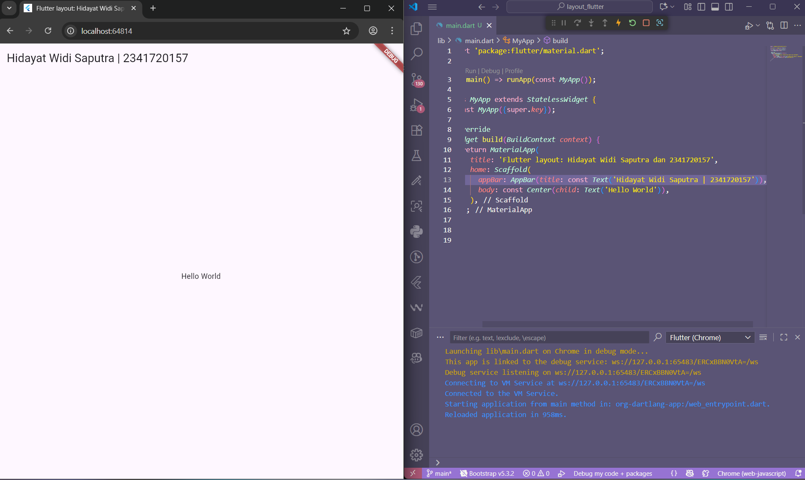
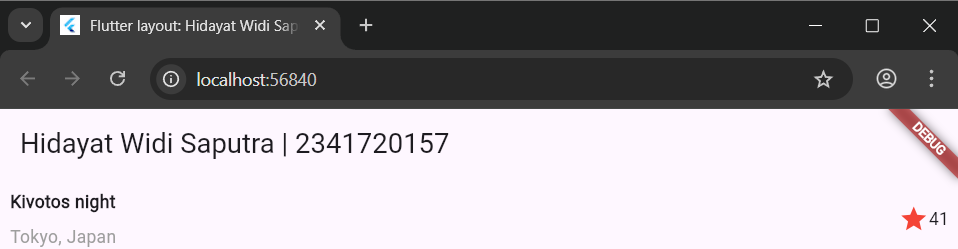
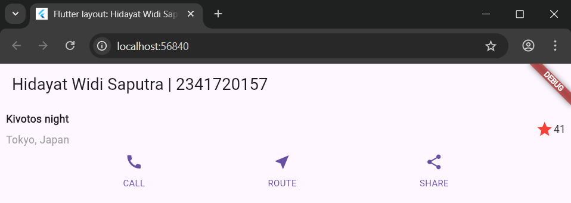
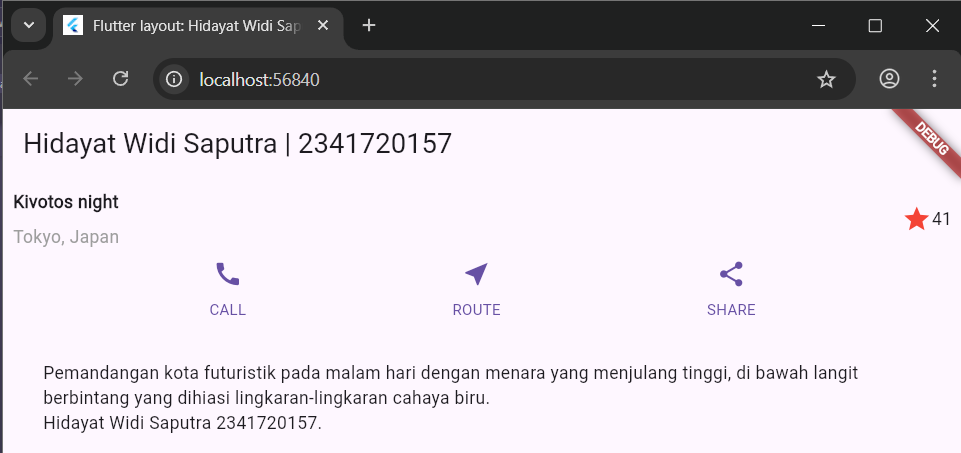
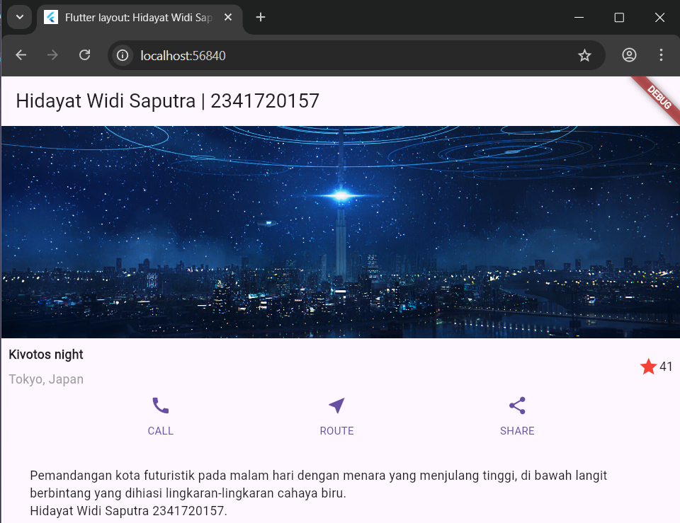

# Tugas Praktikum 1

## 1.Selesaikan Praktikum 1 sampai 4, lalu dokumentasikan dan push ke repository Anda berupa screenshot setiap hasil pekerjaan beserta penjelasannya di file README.md!

### Praktikum 1: Membangun Layout di Flutter

#### Langkah 1: Buat Project Baru

Buatlah sebuah project flutter baru dengan nama layout_flutter. Atau sesuaikan style laporan praktikum yang Anda buat.

#### Langkah 2: Buka file lib/main.dart

Buka file main.dart lalu ganti dengan kode berikut. Isi nama dan NIM Anda di text title.

Hasil:\


#### Langkah 3: Identifikasi layout diagram

Langkah pertama adalah memecah tata letak menjadi elemen dasarnya:

- ### Identifikasi baris dan kolom.

  - Kolom utama (Column):
    - Gambar utama
    - Title section (Row):
      - Column:
        - Title
        - Subtitle
      - Spacer
      - Row:
        - Ikon bintang
        - Jumlah bintang
    - Button section:
      - Row:
        - Ikon
        - Text
      - Row:
        - Ikon
        - Text
      - Row:
        - Ikon
        - Text
    - Blok Teks Deskripsi

- ### Apakah tata letaknya menyertakan kisi-kisi (grid)?
  Tidak
- ### Apakah ada elemen yang tumpang tindih?
  Tidak
- ### Apakah UI memerlukan tab?
  TIdak
- ### Perhatikan area yang memerlukan alignment, padding, atau borders.
  - Title section: `MainAlignment` pada column adalah center
  - Kolom teks di dalam baris judul perlu diberi Expanded agar mengambil ruang sisa.
  - Teks dalam blok deskripsi perlu Padding agar tidak mepet ke tepi layar.

#### Langkah 4: Implementasi title row

Pertama, Anda akan membuat kolom bagian kiri pada judul. Tambahkan kode berikut di bagian atas metode build() di dalam kelas MyApp:

```dart
Widget titleSection = Container(
  padding: const EdgeInsets.all(8.0),
  child: Row(
    children: [
      Expanded(
        /* soal 1*/
        child: Column(
          crossAxisAlignment: CrossAxisAlignment.start,
          children: [
            /* soal 2*/
            Container(
              padding: const EdgeInsets.only(bottom: 8.0),
              child: const Text(
                'Kivotos night',
                style: TextStyle(fontWeight: FontWeight.bold),
              ),
            ),
            Text('Tokyo, Japan', style: TextStyle(color: Colors.grey[500])),
          ],
        ),
      ),
      /* soal 3*/
      Icon(Icons.star, color: Colors.red[500]),
      const Text("41"),
    ],
  ),
);
```

**soal 1** Letakkan widget Column di dalam widget Expanded agar menyesuaikan ruang yang tersisa di dalam widget Row. Tambahkan properti crossAxisAlignment ke CrossAxisAlignment.start sehingga posisi kolom berada di awal baris.

**soal 2** Letakkan baris pertama teks di dalam Container sehingga memungkinkan Anda untuk menambahkan padding = 8. Teks ‘Batu, Malang, Indonesia' di dalam Column, set warna menjadi abu-abu.

**soal 3** Dua item terakhir di baris judul adalah ikon bintang, set dengan warna merah, dan teks "41". Seluruh baris ada di dalam Container dan beri padding di sepanjang setiap tepinya sebesar 32 piksel. Kemudian ganti isi body text ‘Hello World' dengan variabel titleSection

Hasil:\


### Praktikum 2: Implementasi button row

#### Langkah 1: Buat method Column \_buildButtonColumn

```dart
Column _buildButtonColumn(Color color, IconData icon, String label) {
  return Column(
    mainAxisSize: MainAxisSize.min,
    mainAxisAlignment: MainAxisAlignment.center,
    children: [
      Icon(icon, color: color),
      Container(
        margin: const EdgeInsets.only(top: 8),
        child: Text(
          label,
          style: TextStyle(
            fontSize: 12,
            fontWeight: FontWeight.w400,
            color: color,
          ),
        ),
      ),
    ],
  );
}
```

#### Langkah 2: Buat widget buttonSection

```dart
Color color = Theme.of(context).primaryColor;
Widget buttonSection = Row(
  mainAxisAlignment: MainAxisAlignment.spaceEvenly,
  children: [
    _buildButtonColumn(color, Icons.call, 'CALL'),
    _buildButtonColumn(color, Icons.near_me, 'ROUTE'),
    _buildButtonColumn(color, Icons.share, 'SHARE'),
  ],
);
```

#### Langkah 3: Tambah button section ke body

```dart
home: Scaffold(
//
  body: Column(children: [titleSection, buttonSection]),
),
```

Hasil:\


### Praktikum 3: Implementasi text section

#### Langkah 1: Buat widget textSection

```dart
Widget textSection = Container(
  padding: const EdgeInsets.all(32),
  child: const Text(
    'Pemandangan kota futuristik pada malam hari dengan menara yang menjulang tinggi, di bawah langit berbintang yang dihiasi lingkaran-lingkaran cahaya biru. '
    '\nHidayat Widi Saputra '
    '2341720157. ',
    softWrap: true,
  ),
);
```

#### Langkah 2: Tambahkan variabel text section ke body

```dart
home: Scaffold(
//
  body: Column(children: [titleSection, buttonSection, textSection]),
),
```

Hasil:\


### Praktikum 4: Implementasi image section

#### Langkah 1: Siapkan aset gambar

Gambar:\


#### Langkah 2: Tambahkan gambar ke body
```dart
home: Scaffold(
//
  body: Column(
    children: [
      Image.asset(
        'imgs/kivotos_night.jpg',
        width: 600,
        height: 240,
        fit: BoxFit.cover,
      ),
      titleSection,
      buttonSection,
      textSection,
    ],
  ),
),
```

#### Langkah 3: Terakhir, ubah menjadi ListView
```dart
home: Scaffold(
//
  body: ListView(
    children: [
      Image.asset(
        'imgs/kivotos_night.jpg',
        width: 600,
        height: 240,
        fit: BoxFit.cover,
      ),
      titleSection,
      buttonSection,
      textSection,
    ],
  ),
),
```

Hasil:\



## 2. Silakan implementasikan di project baru "basic_layout_flutter" dengan mengakses sumber ini: https://docs.flutter.dev/codelabs/layout-basics

## 3. Kumpulkan link commit repository GitHub Anda kepada dosen yang telah disepakati!
