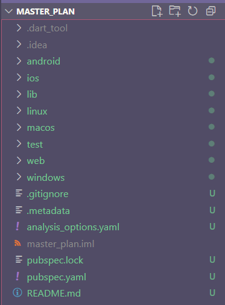
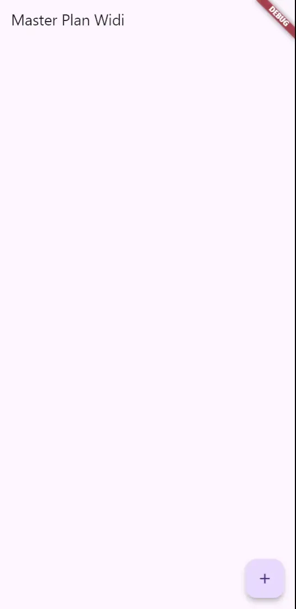
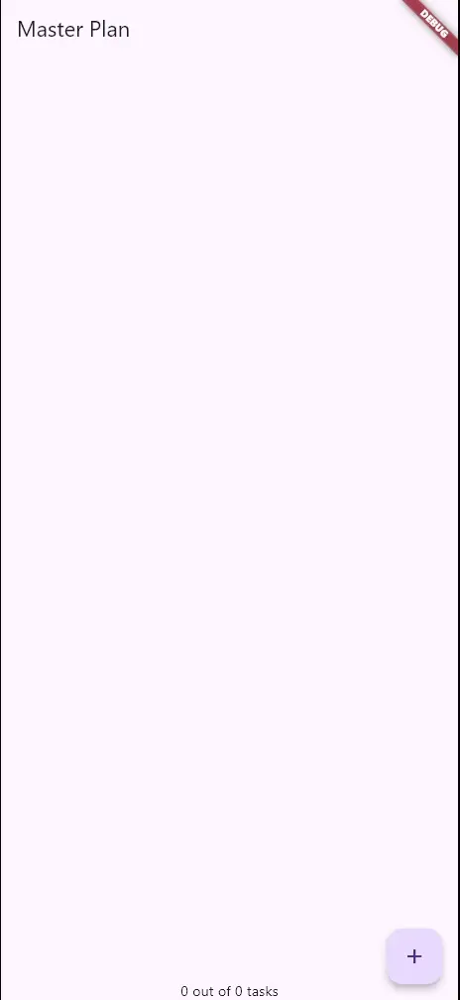

# Tugas Praktikum 1: Dasar State dengan Model-View

## 1. Selesaikan langkah-langkah praktikum tersebut, lalu dokumentasikan berupa GIF hasil akhir praktikum beserta penjelasannya di file README.md! Jika Anda menemukan ada yang error atau tidak berjalan dengan baik, silakan diperbaiki.

## Praktikum 1: Dasar State dengan Model-View

### Langkah 1: Buat Project Baru



### Langkah 2: Membuat model task.dart

```dart
class Task {
  final String description;
  final bool complete;

  const Task({this.complete = false, this.description = ''});
}
```

### Langkah 3: Buat file plan.dart

```dart
import 'task.dart';

class Plan {
  final String name;
  final List<Task> tasks;

  const Plan({this.name = '', this.tasks = const []});
}
```

### Langkah 4: Buat file data_layer.dart

```dart
export 'plan.dart';
export 'task.dart';
```

### Langkah 5: Pindah ke file main.dart

```dart
import 'package:flutter/material.dart';
import './views/plan_screen.dart';

void main() => runApp(MasterPlanApp());

class MasterPlanApp extends StatelessWidget {
  const MasterPlanApp({super.key});

  @override
  Widget build(BuildContext context) {
    return MaterialApp(
      theme: ThemeData(primarySwatch: Colors.purple),
      home: PlanScreen(),
    );
  }
}
```

### Langkah 6: buat plan_screen.dart

```dart
import '../models/data_layer.dart';
import 'package:flutter/material.dart';

class PlanScreen extends StatefulWidget {
  const PlanScreen({super.key});

  @override
  State createState() => _PlanScreenState();
}

class _PlanScreenState extends State<PlanScreen> {
  Plan plan = const Plan();

  @override
  Widget build(BuildContext context) {
    return Scaffold(
      appBar: AppBar(title: const Text('Master Plan Widi')),
      body: _buildList(),
      floatingActionButton: _buildAddTaskButton(),
    );
  }
}
```

### Langkah 7: buat method \_buildAddTaskButton()

```dart
Widget _buildAddTaskButton() {
  return FloatingActionButton(
    child: const Icon(Icons.add),
    onPressed: () {
      setState(() {
        plan = Plan(
          name: plan.name,
          tasks: List<Task>.from(plan.tasks)..add(const Task()),
        );
      });
    },
  );
}
```

### Langkah 8: buat widget \_buildList()

```dart
Widget _buildList() {
  return ListView.builder(
    itemCount: plan.tasks.length,
    itemBuilder: (context, index) => _buildTaskTile(plan.tasks[index], index),
  );
}
```

### Langkah 9: buat widget \_buildTaskTile

```dart
Widget _buildTaskTile(Task task, int index) {
  return ListTile(
    leading: Checkbox(
      value: task.complete,
      onChanged: (selected) {
        setState(() {
          plan = Plan(
            name: plan.name,
            tasks: List<Task>.from(plan.tasks)
              ..[index] = Task(
                description: task.description,
                complete: selected ?? false,
              ),
          );
        });
      },
    ),
    title: TextFormField(
      initialValue: task.description,
      onChanged: (text) {
        setState(() {
          plan = Plan(
            name: plan.name,
            tasks: List<Task>.from(plan.tasks)
              ..[index] = Task(description: text, complete: task.complete),
          );
        });
      },
    ),
  );
}
```

### Langkah 10: Tambah Scroll Controller

```dart
late ScrollController scrollController;
```

### Langkah 11: Tambah Scroll Listener

```dart
@override
void initState() {
  super.initState();
  scrollController = ScrollController()
    ..addListener(() {
      FocusScope.of(context).requestFocus(FocusNode());
    });
}
```

### Langkah 12: Tambah controller dan keyboard behavior

```dart
Widget _buildList() {
  return ListView.builder(
    controller: scrollController,
    itemCount: plan.tasks.length,
    itemBuilder: (context, index) => _buildTaskTile(plan.tasks[index], index),
  );
}
```

### Langkah 13: Terakhir, tambah method dispose()

```dart
@override
void dispose() {
  scrollController.dispose();
  super.dispose();
}
```

### Langkah 14: Hasil



## 2. Jelaskan maksud dari langkah 4 pada praktikum tersebut! Mengapa dilakukan demikian?

Maksud dari langkah ke 4 adalah untuk memudahkan proses import file di proyek, agar tidak ribet setiap kali membutuhkan akses ke model Plan dan Task.

## 3. Mengapa perlu variabel plan di langkah 6 pada praktikum tersebut? Mengapa dibuat konstanta ?

Variabel plan digunakan untuk menyimpan data utama yang ditampilkan di layar. Plan adalah model yang berisi daftar task dan juga nama task tersebut

## 4. Lakukan capture hasil dari Langkah 9 berupa GIF, kemudian jelaskan apa yang telah Anda buat!


Yang telah saya buat adalah komponen to do list yang interaktif, yang bisa ditambh, dicentang dan diedit teksnya.

## 5. Apa kegunaan method pada Langkah 11 dan 13 dalam lifecyle state ?

Kegunaan Langkah 11: initState():

- Inisialisasi ScrollController dan menambahkan listener.
- Listener ini menghilangkan fokus dari TextField ketika pengguna melakukan scroll (dengan FocusScope.of(context).requestFocus(FocusNode())).
- Dipanggil satu kali saat widget pertama kali dibuat, sebelum build() dijalankan.

Kegunaan Langkah 13: dispose():

- Membersihkan resource yang tidak lagi digunakan.
- Dipanggil saat widget dihapus dari tree.

# Tugas Praktikum 2: InheritedWidget

## 1. Selesaikan langkah-langkah praktikum tersebut, lalu dokumentasikan berupa GIF hasil akhir praktikum beserta penjelasannya di file README.md! Jika Anda menemukan ada yang error atau tidak berjalan dengan baik, silakan diperbaiki sesuai dengan tujuan aplikasi tersebut dibuat.

### Langkah 1: Buat file `plan_provider.dart`

Buat folder baru **`provider`** di dalam folder **`lib`**, lalu buat _file_ baru dengan nama **`plan_provider.dart`** berisi kode seperti berikut.

```dart
import 'package:flutter/material.dart';
import '../models/data_layer.dart';

class PlanProvider extends InheritedNotifier<ValueNotifier<Plan>> {
  const PlanProvider({
    super.key,
    required super.child,
    required ValueNotifier<Plan> super.notifier,
  });

  static ValueNotifier<Plan> of(BuildContext context) {
    return context
        .dependOnInheritedWidgetOfExactType<PlanProvider>()!
        .notifier!;
  }
}
```

### Langkah 2: Edit main.dart

Gantilah pada bagian atribut `home` dengan `PlanProvider` seperti berikut. Jangan lupa sesuaikan bagian impor jika dibutuhkan.

```dart
return MaterialApp(
  theme: ThemeData(primarySwatch: Colors.purple),
  home: PlanProvider(
    notifier: ValueNotifier<Plan>(const Plan()),
    child: const PlanScreen(),
   ),
);
```

### Langkah 3: Tambah method pada model plan.dart

Tambahkan dua method di dalam model `class Plan` seperti kode berikut.

```dart
int get completedCount => tasks
  .where((task) => task.complete)
  .length;

String get completenessMessage =>
  '$completedCount out of ${tasks.length} tasks';
```

### Langkah 4: Pindah ke PlanScreen

Edit `PlanScreen` agar menggunakan data dari `PlanProvider`. Hapus deklarasi variabel `plan` (ini akan membuat error). Kita akan perbaiki pada langkah 5 berikut ini.

### Langkah 5: Edit method \_buildAddTaskButton

Tambahkan `BuildContext` sebagai parameter dan gunakan `PlanProvider` sebagai sumber datanya. Edit bagian kode seperti berikut.

```dart
Widget _buildAddTaskButton(BuildContext context) {
  ValueNotifier<Plan> planNotifier = PlanProvider.of(context);
  return FloatingActionButton(
    child: const Icon(Icons.add),
    onPressed: () {
      Plan currentPlan = planNotifier.value;
      planNotifier.value = Plan(
        name: currentPlan.name,
        tasks: List<Task>.from(currentPlan.tasks)..add(const Task()),
      );
    },
  );
}
```

### Langkah 6: Edit method \_buildTaskTile

Tambahkan parameter **`BuildContext`**, gunakan **`PlanProvider`** sebagai sumber data. Ganti **`TextField`** menjadi **`TextFormField`** untuk membuat inisial data _provider_ menjadi lebih mudah.

```dart
void main() {
  runApp(
    const MaterialApp(
      home: PhotoFilterCarousel(),
      debugShowCheckedModeBanner: false,
    ),
  );
}
```

### Langkah 7: Edit \_buildList

Sesuaikan parameter pada bagian `_buildTaskTile` seperti kode berikut.

```dart
Widget _buildList(Plan plan) {
   return ListView.builder(
     controller: scrollController,
     itemCount: plan.tasks.length,
     itemBuilder: (context, index) =>
        _buildTaskTile(plan.tasks[index], index, context),
   );
}
```

### Langkah 8: Tetap di class PlanScreen

Edit method build sehingga bisa tampil progress pada bagian bawah (footer). Caranya, bungkus (wrap) \_buildList dengan widget Expanded dan masukkan ke dalam widget Column seperti kode pada Langkah 9.

### Langkah 9: Tambah widget SafeArea

Terakhir, tambahkan _widget_ **`SafeArea`** dengan berisi **`completenessMessage`** pada akhir _widget_ **`Column`**.

Perhatikan kode berikut ini.

```dart
@override
Widget build(BuildContext context) {
   return Scaffold(
     appBar: AppBar(title: const Text('Master Plan Widi')),
     body: ValueListenableBuilder<Plan>(
       valueListenable: PlanProvider.of(context),
       builder: (context, plan, child) {
         return Column(
           children: [
             Expanded(child: _buildList(plan)),
             SafeArea(child: Text(plan.completenessMessage))
           ],
         );
       },
     ),
     floatingActionButton: _buildAddTaskButton(context),
   );
}
```

### Hasil



## 2. Jelaskan mana yang dimaksud InheritedWidget pada langkah 1 tersebut! Mengapa yang digunakan InheritedNotifier?

Yang dimaksud sebagai `InheritedWidget` adalah class `PlanProvider`, karena class tersebut secara langsung **mewarisi (`extends`)** dari **`InheritedNotifier`**.

```dart
class PlanProvider extends InheritedNotifier<ValueNotifier<Plan>> { ... }
```

Mengapa yang digunakan `InheritedNotifier`? karena `InheritedNotifier` sendiri adalah implementasi khusus yang Flutter sediakan untuk memudahkan kita membuat InheritedWidget yang:

- Memiliki notifier (ChangeNotifier, ValueNotifier, dll...).
- Secara otomatis memanggil notifyClients() (yang memicu rebuild) setiap kali notifier mengeluarkan event.
- Tetap memberikan semua kemudahan InheritedWidget: data bisa diambil di mana saja di bawahnya dengan context.dependOnInheritedWidgetOfExactType() dan hanya rebuild bila data yang mereka gunakan berubah.

## 3. Jelaskan maksud dari method di langkah 3 pada praktikum tersebut! Mengapa dilakukan demikian?

Maksud dari kedua Method yang ditambahkan di langkah 3:

- `int get completedCount`: untuk menghitung jumlah tugas yang memiliki status  bernilai true di dalam daftar tasks.
- `String get completenessMessage`: untuk membuat pesan string yang menunjukkan progress penyelesaian tugas, menggunakan hasil dari completedCount dan total tasks.length.

Mengapa dilakukan demikian? Dengan memisahkan logika ini, model menjadi self-contained dan kode di bagian View menjadi lebih bersih dan mudah dibaca karena tidak perlu lagi melakukan penghitungan progress secara manual.

## 4. Lakukan capture hasil dari Langkah 9 berupa GIF, kemudian jelaskan apa yang telah Anda buat!


Yang telah saya buat adalah memisahkan data dari tampilan, membuat View lebih efisien dan terpisah dari Logic. Serta menambahkan progress di bagian bawah layar

